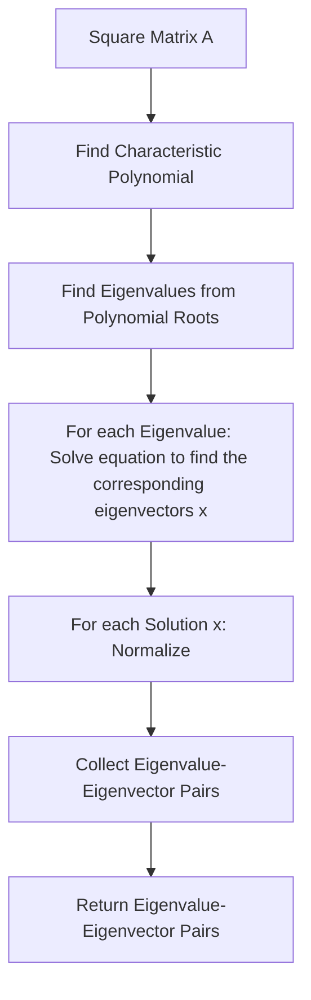

# The-Eigenvalue-Problem

The eigenvalue problem is a fundamental concept in linear algebra and is used to find the special numbers and vectors that characterize a linear transformation. Given a square matrix A, the eigenvalue problem is to find the non-zero vectors x and scalar λ that satisfy the equation:

Ax = λx

Here, x is the eigenvector and λ is the eigenvalue associated with that eigenvector. The equation states that when the linear transformation represented by A is applied to the vector x, the result is a scalar multiple of x. In other words, the eigenvector x is transformed only by scaling, with the scaling factor given by the eigenvalue λ.

# Solving the Eigenvalue problem
Solving the eigenvalue problem involves finding the eigenvalues and corresponding eigenvectors of the matrix A. These values play a crucial role in various applications, including in physics, engineering, and computer science. They are used to study the behavior of systems, to identify important patterns, and to analyze data, among other things.



The steps involved in solving the eigenvalue problem are:

1. Find the characteristic polynomial of the square matrix A.
2. Find the roots of the characteristic polynomial, which correspond to the eigenvalues of A.
3. For each eigenvalue λ, solve the equation (A - λI)x = 0 to find the corresponding eigenvectors x.
4. Normalize each eigenvector to ensure that its length is 1.
5. Collect the eigenvalue-eigenvector pairs.
6. Return the pairs as the solution to the eigenvalue problem.
7. This flowchart provides a high-level overview of the process involved in solving the eigenvalue problem. Of course, there are many details involved in each step, and different methods may be used to carry out the computations. However, this flowchart gives a good sense of the overall structure of the solution process.

# Example in python

In this script, we first define a 2x2 square matrix A using NumPy's array function. We then use NumPy's linalg.eig function to find the eigenvalues and eigenvectors of A.

The eig function returns two arrays: eigenvalues and eigenvectors. The eigenvalues array contains the eigenvalues of A, and the eigenvectors array contains the corresponding eigenvectors, stored as columns of the array.

We then print the eigenvalues and eigenvectors to the console.

To verify that the eigenvalue-eigenvector pairs are indeed valid, we loop through each eigenvalue-eigenvector pair and check whether the equation Ax
```
import numpy as np

# Define the square matrix A
A = np.array([[1, 2], [2, 1]])

# Find the eigenvalues and eigenvectors of A
eigenvalues, eigenvectors = np.linalg.eig(A)

# Print the eigenvalues and eigenvectors
print("Eigenvalues:", eigenvalues)
print("Eigenvectors:", eigenvectors)

# Verify that Ax = λx for each eigenvalue-eigenvector pair
for i in range(len(eigenvalues)):
    lambda_i = eigenvalues[i]
    x_i = eigenvectors[:, i]
    ax_i = np.dot(A, x_i)
    lmbd_x_i = lambda_i * x_i
    print("λ_{} x_{}: ".format(i+1, i+1), lmbd_x_i)
    print("Ax_{}: ".format(i+1), ax_i)
    print("Are they equal? ", np.allclose(lmbd_x_i, ax_i))
```
